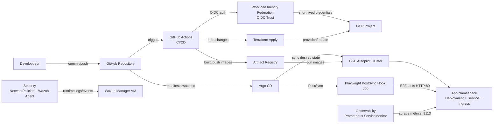
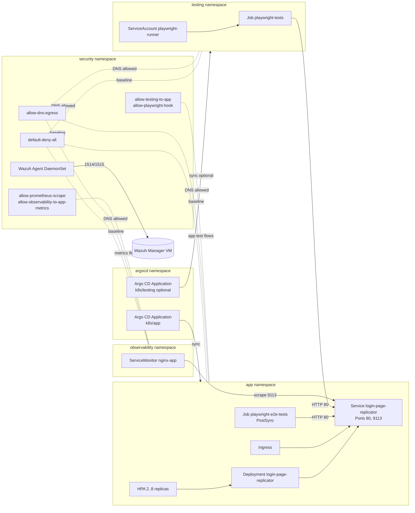

# Diagrammes du projet

Ce fichier contient 3 diagrammes Mermaid:
1. Diagramme DevSecOps (flux CI/CD + securite + tests)
2. Architecture physique (GCP)
3. Architecture logique (Kubernetes)

## 1) Diagramme DevSecOps



## 2) Architecture physique (GCP)

```mermaid
flowchart TB
  subgraph GCP[GCP Project]
    subgraph NET[VPC: devops-vpc]
      SUB[Subnet: devops-subnet\nNodes: 10.10.0.0/20\nPods: 10.20.0.0/16\nServices: 10.30.0.0/20]
    end

    GAR[Artifact Registry\nApp + Playwright Images]

    subgraph GKE[GKE Autopilot: devops-cluster]
      INGRESS[GKE Ingress\nExternal HTTP(S)]
      NODEPOOL[Managed Autopilot Nodes]
      NSAPP[Namespace app]
      NSTEST[Namespace testing]
      NSOBS[Namespace observability]
      NSSEC[Namespace security]
      NSARGO[Namespace argocd]
    end

    WAZUHVM[Compute Engine VM\nWazuh Manager\nPorts 1514/1515/55000]
  end

  Internet[Users / Browser] --> INGRESS
  INGRESS --> NSAPP

  GAR -->|image pull| GKE

  NSSEC -->|agent traffic| WAZUHVM
  SUB --- GKE
  SUB --- WAZUHVM
```

## 3) Architecture logique (Kubernetes)



## Utilisation
- Vous pouvez copier ces blocs Mermaid dans votre rapport principal `docs/rapport_projet.md`.
- Si votre visualiseur Markdown supporte Mermaid (GitHub, GitLab, Obsidian, etc.), les schemas seront rendus automatiquement.

