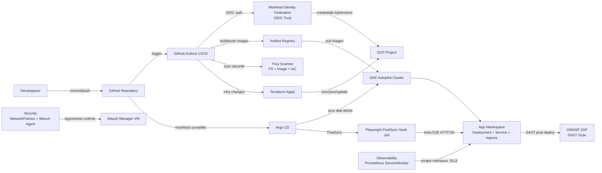
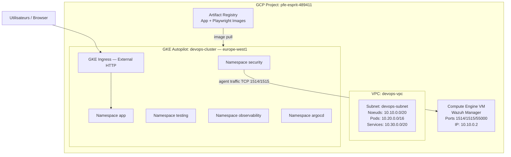

# Rapport de Projet de Fin d'Études
## Industrialisation DevSecOps d'une Application Web Cloud-Native

---

**Établissement :** ESPRIT — École Supérieure Privée d'Ingénierie et de Technologies  
**Filière :** Génie Logiciel / Sécurité Informatique  
**Niveau :** Mastère / Ingénierie  
**Entreprise d'accueil :** Sopra Steria  
**Encadrant entreprise :** —  
**Encadrant académique :** —  
**Auteur :** NAFFATI  
**Date :** Avril 2026  

---

## Dédicace

> *À tous ceux qui croient que la sécurité n'est pas une fonctionnalité optionnelle, mais une responsabilité fondamentale de tout ingénieur logiciel.*

---

## Remerciements

Je tiens à remercier l'ensemble de l'équipe Sopra Steria pour l'accueil, le soutien technique et la confiance accordée tout au long de ce projet. Je remercie également mes encadrants académiques de l'ESPRIT pour leurs conseils précieux et leur suivi rigoureux.

---

## Résumé

Ce rapport présente la conception et l'implémentation d'une plateforme **DevSecOps** complète autour d'une application web moderne développée avec React, TypeScript et Vite, déployée sur **Google Kubernetes Engine (GKE)** en mode Autopilot. Le projet part d'une situation initiale où l'équipe utilisait uniquement **Jenkins** comme pipeline d'intégration continue pour exécuter des tests, sans aucune considération de sécurité intégrée.

L'objectif principal est de transformer cette approche naïve en une **chaîne de valeur logicielle sécurisée de bout en bout**, en intégrant : l'Infrastructure as Code avec Terraform, le GitOps avec Argo CD, l'analyse de vulnérabilités avec Trivy et OWASP ZAP, la sécurité runtime avec Wazuh SIEM, l'observabilité avec Prometheus et Grafana, et un modèle d'identité sans clés statiques via Workload Identity Federation.

Le résultat est une plateforme reproductible, auditable, et directement applicable à des contextes de production réels.

**Mots-clés :** DevSecOps, Kubernetes, GKE, Terraform, Argo CD, Trivy, OWASP ZAP, Wazuh, CI/CD, GitOps, Zero Trust, Workload Identity, SAST, DAST, SCA.

---

## Abstract

This report presents the design and implementation of a complete **DevSecOps** platform built around a modern web application developed with React, TypeScript, and Vite, deployed on **Google Kubernetes Engine (GKE)** in Autopilot mode. The project starts from an initial situation where the team was using only **Jenkins** as a continuous integration pipeline to run tests, with no integrated security considerations.

The main objective is to transform this naive approach into a **secure end-to-end software value chain**, integrating: Infrastructure as Code with Terraform, GitOps with Argo CD, vulnerability analysis with Trivy and OWASP ZAP, runtime security with Wazuh SIEM, observability with Prometheus and Grafana, and a keyless identity model via Workload Identity Federation.

The result is a reproducible, auditable platform, directly applicable to real production contexts.

**Keywords:** DevSecOps, Kubernetes, GKE, Terraform, Argo CD, Trivy, OWASP ZAP, Wazuh, CI/CD, GitOps, Zero Trust, Workload Identity, SAST, DAST, SCA.

---

## Table des Matières

1. [Introduction Générale](#1-introduction-générale)
2. [Contexte et Problématique](#2-contexte-et-problématique)
3. [Étude de l'Existant — L'Approche Jenkins](#3-étude-de-lexistant--lapproche-jenkins)
4. [Vision Cible et Principes DevSecOps](#4-vision-cible-et-principes-devsecops)
5. [Architecture de la Solution](#5-architecture-de-la-solution)
6. [L'Application Cible : Todo App React](#6-lapplication-cible--todo-app-react)
7. [Infrastructure as Code avec Terraform](#7-infrastructure-as-code-avec-terraform)
8. [Containerisation et Sécurité des Images](#8-containerisation-et-sécurité-des-images)
9. [Orchestration Kubernetes sur GKE](#9-orchestration-kubernetes-sur-gke)
10. [Pipeline CI/CD avec GitHub Actions](#10-pipeline-cicd-avec-github-actions)
11. [GitOps avec Argo CD](#11-gitops-avec-argo-cd)
12. [Sécurité Applicative — SAST, SCA, DAST](#12-sécurité-applicative--sast-sca-dast)
13. [Sécurité Runtime — Wazuh SIEM](#13-sécurité-runtime--wazuh-siem)
14. [Réseau Zero Trust — NetworkPolicies](#14-réseau-zero-trust--networkpolicies)
15. [Identité et Gouvernance IAM](#15-identité-et-gouvernance-iam)
16. [Tests Automatisés — Qualité et Sécurité](#16-tests-automatisés--qualité-et-sécurité)
17. [Observabilité et Monitoring](#17-observabilité-et-monitoring)
18. [Démonstration des Vulnérabilités Intentionnelles](#18-démonstration-des-vulnérabilités-intentionnelles)
19. [Résultats Obtenus et Comparaison Avant/Après](#19-résultats-obtenus-et-comparaison-avantaprès)
20. [Limites et Plan d'Amélioration](#20-limites-et-plan-damélioration)
21. [Conclusion Générale](#21-conclusion-générale)
22. [Annexes Techniques](#22-annexes-techniques)
23. [Bibliographie](#23-bibliographie)

---

## 1. Introduction Générale

### 1.1 Contexte du Projet de Fin d'Études

Ce projet de fin d'études s'inscrit dans le cadre d'un stage d'ingénierie au sein de **Sopra Steria**, groupe international de conseil et de services numériques. La mission confiée est de moderniser et de sécuriser le cycle de vie logiciel d'une application web en adoptant une approche **DevSecOps** complète, depuis le code source jusqu'à la production sur le cloud.

La transformation numérique des entreprises impose aujourd'hui des exigences croissantes en matière de rapidité de livraison, de fiabilité des systèmes, et surtout de **sécurité intégrée**. Les organisations qui déploient des applications cloud-native font face à une complexité croissante : gestion de conteneurs, orchestration Kubernetes, multiplication des pipelines CI/CD, et une surface d'attaque qui s'étend à chaque couche de la chaîne de valeur.

### 1.2 Objectifs du Rapport

Ce rapport a pour but de :
- Documenter la **démarche complète** de conception et d'implémentation d'une plateforme DevSecOps
- Démontrer la **valeur ajoutée** par rapport à l'approche initiale basée sur Jenkins sans sécurité
- Présenter les **choix techniques** et les justifications architecturales
- Illustrer les **résultats concrets** obtenus à travers des métriques et des captures d'artefacts
- Proposer un **plan d'amélioration continue** pour les phases suivantes

### 1.3 Structure du Rapport

Le rapport est organisé de manière progressive : on commence par analyser le contexte et l'existant, puis on décrit la solution architecturale globale avant de plonger dans chaque couche technique (infrastructure, conteneurs, orchestration, sécurité, tests, observabilité). On conclut par une comparaison quantifiée avant/après et un plan de continuité.

---

## 2. Contexte et Problématique

### 2.1 Le Modèle "Deploy First, Secure Later" et ses Limites

Pendant longtemps, les équipes de développement ont fonctionné selon un modèle où la sécurité était traitée comme une **étape finale**, voire optionnelle. On codait, on testait les fonctionnalités, on déployait — et on pensait à la sécurité "plus tard", souvent lors d'un audit annuel ou après un incident.

Ce modèle présente des problèmes fondamentaux :

| Problème | Conséquence |
|---|---|
| Vulnérabilités découvertes tard dans le cycle | Coût de correction 10x à 100x plus élevé |
| Secrets hardcodés dans le code | Risque de compromission de l'infrastructure |
| Images Docker non scannées | CVEs critiques en production |
| Accès réseau non restreints | Propagation latérale en cas d'intrusion |
| Pas de monitoring sécurité runtime | Détection des attaques impossible |

### 2.2 Les Pressions Réglementaires et Industrielles

En 2026, les exigences réglementaires renforcent cette nécessité :
- **NIS2** (Network and Information Security Directive) impose des contrôles de sécurité sur les chaînes d'approvisionnement logicielles
- **DORA** (Digital Operational Resilience Act) impose la résilience et la traçabilité des changements
- **ISO 27001** et **SOC 2** sont devenus des critères de sélection des fournisseurs
- Les standards **SLSA** (Supply-chain Levels for Software Artifacts) définissent des niveaux d'intégrité des artefacts logiciels

### 2.3 Problématique Centrale

La problématique de ce projet se formule ainsi :

> **Comment transformer un pipeline CI/CD basique (Jenkins + tests unitaires) en une chaîne DevSecOps complète qui intègre la sécurité à chaque étape, sans sacrifier la vélocité de livraison, et avec des preuves auditables de conformité ?**

Cette problématique est multidimensionnelle :
- **Technique :** Quels outils choisir ? Comment les intégrer ?
- **Organisationnelle :** Comment shift-left la sécurité dans les pratiques d'équipe ?
- **Économique :** Comment démontrer le ROI de la sécurité intégrée ?
- **Opérationnelle :** Comment maintenir la visibilité sur un système distribué complexe ?

---

## 3. Étude de l'Existant — L'Approche Jenkins

### 3.1 Description de l'Ancienne Architecture

Avant ce projet, le système en place reposait sur une approche minimaliste et très courante dans les petites équipes :

```
Développeur
    │
    ▼ git push
GitHub Repository
    │
    ▼ webhook
Jenkins Server (auto-hébergé)
    │
    ├── npm install
    ├── npm test (jest/vitest)
    └── (si tests OK) → déploiement manuel ou script shell
```

**Caractéristiques de l'ancienne approche :**

| Aspect | État Avant |
|---|---|
| Outil CI | Jenkins (auto-hébergé, configuration manuelle) |
| Tests | Uniquement tests unitaires JavaScript |
| Sécurité | **Aucune** |
| Scan de vulnérabilités | Absent |
| Scan des images Docker | Absent |
| Scan des secrets | Absent |
| Tests E2E | Absents ou manuels |
| Infrastructure | Créée manuellement via console GCP (ClickOps) |
| Déploiement | Scripts shell ad-hoc, pas versionnés |
| Authentification CI | Clés JSON longue durée dans les secrets Jenkins |
| Monitoring | Basique (CPU/mémoire) |
| Sécurité réseau | Pas de NetworkPolicies |
| SIEM | Absent |
| Audit trail | Inexistant |

### 3.2 Problèmes Identifiés dans l'Ancienne Approche

**Problème 1 — Absence totale de sécurité dans le pipeline :**
Le pipeline Jenkins se contentait de vérifier que les tests passaient. Aucune analyse statique de sécurité (SAST), aucun scan de dépendances (SCA), aucun scan d'images Docker n'était effectué. Des vulnérabilités critiques pouvaient transiter du code source jusqu'en production sans être détectées.

**Problème 2 — Clés d'authentification statiques :**
Jenkins utilisait des clés JSON Google Cloud Service Account avec des permissions larges, stockées en clair dans la configuration Jenkins ou dans des variables d'environnement. La compromission de ces clés aurait donné un accès complet à l'infrastructure GCP.

**Problème 3 — Infrastructure non reproductible :**
Les ressources GCP (cluster Kubernetes, réseau, IAM) étaient créées manuellement via la console. Il était impossible de recréer l'environnement de façon fiable, et les modifications n'étaient pas tracées.

**Problème 4 — Déploiements impératifs non versionnés :**
Les déploiements étaient effectués via des commandes `kubectl apply` ou des scripts shell non versionnés, sans historique, sans rollback automatique, et sans validation de l'état désiré.

**Problème 5 — Aucune visibilité sur la sécurité en production :**
Après le déploiement, aucun outil ne surveillait les comportements anormaux, les tentatives d'intrusion, ou les événements de sécurité sur les noeuds Kubernetes.

**Problème 6 — Tests non représentatifs :**
Les tests unitaires lancés par Jenkins ne testaient que des fonctions isolées, sans jamais valider le comportement réel de l'application dans son contexte de déploiement (vrai navigateur, vraie base de données, vrais services).

### 3.3 Dette Technique et Sécuritaire Accumulée

Le tableau ci-dessous résume la dette accumulée selon les dimensions OWASP Top 10 :

| OWASP Category | État Avant ce Projet |
|---|---|
| A01 - Broken Access Control | Non contrôlé (credentials hardcodés) |
| A02 - Cryptographic Failures | Secrets en clair dans le code et CI |
| A03 - Injection (XSS) | Non détecté, pas de SAST |
| A05 - Security Misconfiguration | Containers root, pas de NetworkPolicies |
| A06 - Vulnerable Components | Dépendances jamais auditées |
| A08 - Software Integrity Failures | Images non signées, pas de SBOM |
| A09 - Security Logging Failures | Aucun SIEM, aucun audit trail |

---

## 4. Vision Cible et Principes DevSecOps

### 4.1 Définition du DevSecOps

**DevSecOps** est une extension de la philosophie DevOps qui intègre la sécurité (**Sec**) comme responsabilité partagée, continue, et automatisée dans le cycle de développement. L'idée fondamentale est le **Shift-Left** : déplacer les contrôles de sécurité le plus tôt possible dans le cycle, là où les corrections sont les moins coûteuses.

```
SHIFT LEFT ←─────────────────────────────────────────
                                                       
Plan → Code → Build → Test → Release → Deploy → Monitor
  ↑       ↑      ↑       ↑       ↑         ↑       ↑
Security Security Security Security Security Security Security
 Review  SAST/   SCA/    DAST   Signing  Hardening  SIEM
         Lint    Trivy   ZAP    cosign   K8s Sec   Wazuh
```

### 4.2 Les Huit Principes Directeurs du Projet

| # | Principe | Implémentation |
|---|---|---|
| 1 | **Tout est Code** | Terraform pour l'infra, YAML pour K8s, tout versionné dans Git |
| 2 | **Sécurité Shift-Left** | Trivy + SonarCloud dès le build, avant tout déploiement |
| 3 | **Keyless First** | Workload Identity Federation — zéro clé JSON statique |
| 4 | **Zero Trust Réseau** | NetworkPolicies default-deny, flux explicitement autorisés |
| 5 | **GitOps** | Argo CD comme seul moteur de réconciliation du cluster |
| 6 | **Tests au plus proche du réel** | Playwright E2E dans le cluster, PostSync hooks |
| 7 | **Observabilité Continue** | Prometheus + Grafana + Wazuh en permanence |
| 8 | **Preuves Auditables** | Chaque outil génère des rapports uploadés comme artefacts CI |

### 4.3 Comparaison des Approches

| Dimension | Ancienne Approche (Jenkins) | Nouvelle Approche (DevSecOps) |
|---|---|---|
| Sécurité | Post-déploiement ou absente | Intégrée à chaque étape du pipeline |
| Infrastructure | ClickOps manuel | Terraform IaC versionné |
| Déploiement | Scripts impératifs | GitOps déclaratif (Argo CD) |
| Tests | Unitaires seulement | Unit + E2E in-cluster + Security scans |
| Authentification | Clés JSON statiques | OIDC Workload Identity Federation |
| Réseau | Ouvert par défaut | Zero Trust (default-deny) |
| Monitoring | CPU/RAM basique | Métriques + SIEM + alertes |
| Audit trail | Inexistant | Chaque commit, build, déploiement tracé |
| Rollback | Manuel | Automatique via Git revert + Argo CD |

---

## 5. Architecture de la Solution

### 5.1 Vue Globale de la Plateforme

La solution s'articule autour de **six couches complémentaires** :

```
┌─────────────────────────────────────────────────────────────┐
│  COUCHE 6 — SÉCURITÉ RUNTIME                                │
│  Wazuh SIEM · NetworkPolicies · Workload Identity           │
├─────────────────────────────────────────────────────────────┤
│  COUCHE 5 — OBSERVABILITÉ                                   │
│  Prometheus · Grafana · nginx-exporter · ServiceMonitor     │
├─────────────────────────────────────────────────────────────┤
│  COUCHE 4 — ORCHESTRATION                                   │
│  GKE Autopilot · Namespaces · HPA · Ingress                 │
├─────────────────────────────────────────────────────────────┤
│  COUCHE 3 — LIVRAISON                                       │
│  GitHub Actions · Argo CD · Artifact Registry               │
├─────────────────────────────────────────────────────────────┤
│  COUCHE 2 — SÉCURITÉ APPLICATIVE                            │
│  Trivy · OWASP ZAP · SonarCloud · Playwright E2E            │
├─────────────────────────────────────────────────────────────┤
│  COUCHE 1 — INFRASTRUCTURE                                  │
│  Terraform · GCP VPC · GKE · IAM · Artifact Registry        │
└─────────────────────────────────────────────────────────────┘
```

### 5.2 Diagramme DevSecOps — Flux Complet



### 5.3 Architecture Physique GCP



### 5.4 Architecture Logique Kubernetes

Le cluster est segmenté en **5 namespaces fonctionnels** avec des responsabilités strictement séparées :

| Namespace | Rôle | Ressources principales |
|---|---|---|
| `app` | Workload applicatif | Deployment, Service, Ingress, HPA, PostSync Job |
| `testing` | Validation E2E | Playwright Job, ServiceAccount |
| `observability` | Collecte de métriques | Prometheus, Grafana, ServiceMonitor |
| `security` | Politiques et SIEM | NetworkPolicies, Wazuh Agent DaemonSet |
| `argocd` | Moteur GitOps | Argo CD Applications |

---

## 6. L'Application Cible : Todo App React

### 6.1 Description Fonctionnelle

L'application déployée est une **Todo App** avec un portail de connexion, développée avec React 18 et TypeScript. Bien que l'application en elle-même soit simple, elle sert de support idéal pour illustrer tous les aspects DevSecOps car elle possède :

- Une **authentification** (cible pour les tests de sécurité)
- Une **interaction utilisateur** (cible pour les tests E2E et XSS)
- Une **persistance de données** (localStorage — cible pour les vulnérabilités de stockage)
- Une **chaîne de dépendances npm** (cible pour le SCA)

### 6.2 Stack Technique Applicatif

| Couche | Technologie | Version |
|---|---|---|
| Framework UI | React | 18.3.1 |
| Langage | TypeScript | 5.8.3 |
| Build tool | Vite | 8.0.0 |
| Styling | Tailwind CSS + Rosé Pine theme | 3.4.17 |
| Composants UI | shadcn/ui (Radix UI) | — |
| Animations | Framer Motion | 12.x |
| Routing | React Router DOM | 6.30.1 |
| Gestionnaire de paquets | Bun | Latest |
| Serveur de production | Nginx | 1.21 (vulnérable, intentionnel) |

### 6.3 Flux Applicatif

```
Browser
  │
  ▼
Login Component (TNEEIN / 4YOU)
  │ succès
  ▼
TodoDashboard
  ├── Ajouter une tâche (input → localStorage)
  ├── Cocher une tâche (toggle completed)
  └── Supprimer une tâche (filter)
```

**Note sécurité :** Le composant `TodoItem` utilise intentionnellement `dangerouslySetInnerHTML` pour rendre le texte des tâches, créant une vulnérabilité **XSS stockée** détectable par OWASP ZAP et SonarCloud. Ce choix est délibéré pour la démonstration.

### 6.4 Contexte d'Authentification

```typescript
// src/contexts/AuthContext.tsx
const USERS: Record<string, { password: string; user: User }> = {
  TNEEIN01: { password: "4YOU", user: { id: "TNEEIN01", name: "TNEEIN01 TEST1", folderCount: 9 } },
  TNEEMA01: { password: "4YOU", user: { id: "TNEEMA01", name: "TNEEMA01 TEST2", folderCount: 5 } },
};
```

Ce contexte représente une authentification hardcodée côté client — vulnérabilité intentionnelle démontrant la nécessité d'une gestion des secrets appropriée (Secret Manager).

---

## 7. Infrastructure as Code avec Terraform

### 7.1 Justification du Choix Terraform

Face à l'ancienne approche ClickOps, **Terraform** a été choisi pour les raisons suivantes :

| Critère | ClickOps | Terraform IaC |
|---|---|---|
| Reproductibilité | Non | Oui — `terraform apply` recrée tout |
| Versioning | Non | Git — chaque changement est tracé |
| Rollback | Non | `terraform destroy` + re-apply |
| Documentation | Non | Le code *est* la documentation |
| Audit trail | Non | `terraform plan` + historique Git |
| Collaboration | Difficile | PR reviews sur les changements infra |

### 7.2 Structure des Modules Terraform

```
terraform/
├── main.tf          # Provider GCP, backend GCS, versions
├── variables.tf     # Variables paramétrables
├── outputs.tf       # Sorties utiles pour le pipeline
├── apis.tf          # Activation des APIs GCP nécessaires
├── network.tf       # VPC devops-vpc, subnet, ranges secondaires
├── gke.tf           # Cluster GKE Autopilot devops-cluster
├── iam.tf           # Comptes de service, bindings IAM
├── wif.tf           # Workload Identity Federation (GitHub → GCP)
├── wazuh.tf         # VM e2-medium Wazuh Manager + firewalls
└── scripts/
    └── wazuh-manager-init.sh  # Bootstrap automatique Wazuh
```

### 7.3 Ressources Provisionnées

**VPC et Réseau (`network.tf`) :**
- VPC `devops-vpc` dédié au projet
- Subnet `devops-subnet` avec plages secondaires :
  - Noeuds : `10.10.0.0/20`
  - Pods : `10.20.0.0/16`
  - Services : `10.30.0.0/20`
- Cette segmentation permet des règles firewall précises par type de ressource

**Cluster GKE Autopilot (`gke.tf`) :**
```hcl
resource "google_container_cluster" "main" {
  name     = "devops-cluster"
  location = var.region          # europe-west1
  
  enable_autopilot = true        # Mode managé — pas de gestion de noeuds
  
  workload_identity_config {
    workload_pool = "${var.project_id}.svc.id.goog"
  }
  
  release_channel {
    channel = "REGULAR"          # Mises à jour Kubernetes automatiques
  }
}
```

**Avantages GKE Autopilot :**
- Scaling automatique des noeuds selon la charge
- Patches de sécurité des noeuds gérés par Google
- Profil de sécurité renforcé par défaut (restricted Pod Security Standards)
- Facturation à la ressource pod, pas au noeud

**VM Wazuh Manager (`wazuh.tf`) :**
```hcl
resource "google_compute_instance" "wazuh_manager" {
  name         = "wazuh-manager"
  machine_type = "e2-medium"
  zone         = "${var.region}-b"
  
  boot_disk {
    initialize_params {
      image = "ubuntu-os-cloud/ubuntu-2204-lts"
      size  = 50
    }
  }
  
  metadata_startup_script = file("scripts/wazuh-manager-init.sh")
}
```

### 7.4 Bonnes Pratiques Terraform Appliquées

- **Backend distant :** State stocké dans GCS avec versioning activé
- **Dépendances explicites :** `depends_on` pour les ressources qui nécessitent une API activée
- **Variables externalisées :** `project_id`, `region`, `repo_name` paramétrables
- **Sorties utiles :** Endpoint cluster, URL Artifact Registry exposés en `outputs.tf`

---

## 8. Containerisation et Sécurité des Images

### 8.1 Build Multi-Étapes

Le `Dockerfile` utilise un **build multi-étapes** pour minimiser la taille de l'image finale et la surface d'attaque :

```dockerfile
# Stage 1 : Build avec Bun
FROM oven/bun:1 AS builder
WORKDIR /app
COPY package.json bun.lock ./
RUN bun install
COPY . .
RUN bun run build
# → dist/ contient uniquement les assets statiques compilés

# Stage 2 : Serveur Nginx minimal
FROM nginx:1.21 AS runner    # ⚠️ Version vulnérable — démo intentionnelle
COPY --from=builder /app/dist /usr/share/nginx/html
COPY ./nginx.conf /etc/nginx/conf.d/default.conf
EXPOSE 80
CMD ["nginx", "-g", "daemon off;"]
```

**Avantages du multi-stage :**
- Le compilateur Bun et les `node_modules` ne sont pas dans l'image finale
- L'image runner contient uniquement nginx + les assets statiques
- Réduction de la surface d'attaque de l'image de production

### 8.2 Vulnérabilités Intentionnelles dans le Dockerfile

Pour la démonstration des outils de sécurité, plusieurs vulnérabilités ont été introduites intentionnellement :

| Vulnérabilité | Ligne Dockerfile | Outil de Détection | Identifiant |
|---|---|---|---|
| Image nginx obsolète (CVEs OS) | `FROM nginx:1.21` | Trivy | Multiple CVEs |
| Secrets hardcodés en ENV | `ENV APP_SECRET=...` | Trivy Secret Scan | HIGH |
| Fichier `.env` copié dans l'image | `COPY .env /app/.env` | Trivy Secret Scan | HIGH |
| Exécution en root (pas de USER) | Absent | Trivy | DS002 |
| Pas de HEALTHCHECK | Absent | Trivy | DS026 |

### 8.3 Scan Trivy des Images

Trivy effectue plusieurs types de scans sur l'image construite :

```yaml
# .github/workflows/deploy.yml — job trivy-image-app
- name: Trivy Image Scan
  uses: aquasecurity/trivy-action@master
  with:
    image-ref: '${{ env.IMAGE_NAME }}:${{ env.SHORT_SHA }}'
    format: 'sarif'
    output: 'trivy-image-results.sarif'
    severity: 'CRITICAL,HIGH,MEDIUM,LOW'
    scanners: 'vuln,secret,misconfig'
```

Les résultats sont uploadés en SARIF vers l'onglet **GitHub Security** et en HTML comme artefact téléchargeable.

### 8.4 Image Nginx : Comparaison Avant/Après

| Aspect | nginx:1.21 (vulnérable) | nginx:alpine (durci) |
|---|---|---|
| CVEs OS critiques | Plusieurs dizaines | Quasi-inexistants |
| Taille image | ~133 MB | ~23 MB |
| Utilisateur | root | non-root possible |
| Surface d'attaque | Large | Minimale |

---

## 9. Orchestration Kubernetes sur GKE

### 9.1 Structure des Manifests

```
k8s/
├── namespaces.yaml              # Déclaration des 5 namespaces
├── app/
│   ├── deployment.yaml          # Déploiement applicatif
│   ├── service.yaml             # Service ClusterIP (HTTP + metrics)
│   ├── ingress.yaml             # Ingress GCE — exposition externe
│   ├── hpa.yaml                 # HorizontalPodAutoscaler
│   ├── serviceaccount.yaml      # KSA gke-app-sa + annotation WI
│   └── playwright-hook.yaml     # PostSync jobs @t1 à @t6
├── testing/
│   ├── playwright-job.yaml      # Job E2E standalone
│   └── serviceaccount.yaml      # KSA playwright-runner
├── security/
│   ├── default-deny.yaml        # Politique default-deny par namespace
│   ├── allow-dns-egress.yaml    # Autoriser DNS TCP/UDP 53
│   ├── allow-testing-to-app.yaml
│   ├── allow-playwright-hook.yaml
│   ├── allow-prometheus-scrape.yaml
│   ├── allow-observability-to-app-metrics.yaml
│   ├── allow-wazuh-egress.yaml
│   ├── wazuh-agent-daemonset.yaml
│   └── kustomization.yaml
├── observability/
│   └── servicemonitor-nginx.yaml
└── argocd/
    ├── app-application.yaml     # Argo CD App pour k8s/app/
    └── testing-application.yaml # Argo CD App optionnelle pour k8s/testing/
```

### 9.2 Déploiement Applicatif

Le déploiement dans `k8s/app/deployment.yaml` définit deux containers dans le même pod :

**Container 1 — Application :**
```yaml
containers:
  - name: app
    image: europe-west1-docker.pkg.dev/pfe-esprit-489411/login-page-replicator-repo/login-page-replicator:b9c0e2e
    ports:
      - containerPort: 80
    resources:
      requests:
        cpu: 100m
        memory: 128Mi
```

**Container 2 — Nginx Exporter (sidecar) :**
```yaml
  - name: nginx-exporter
    image: nginx/nginx-prometheus-exporter:1.1.0
    args:
      - -nginx.scrape-uri=http://127.0.0.1/stub_status
    ports:
      - containerPort: 9113
        name: metrics
    resources:
      requests:
        cpu: 10m
        memory: 32Mi
      limits:
        cpu: 50m
        memory: 64Mi
```

Le sidecar expose les métriques Nginx en format Prometheus sur le port 9113, collectées par le ServiceMonitor.

### 9.3 Horizontal Pod Autoscaler

```yaml
# k8s/app/hpa.yaml
spec:
  scaleTargetRef:
    apiVersion: apps/v1
    kind: Deployment
    name: login-page-replicator
  minReplicas: 2
  maxReplicas: 8
  metrics:
    - type: Resource
      resource:
        name: cpu
        target:
          type: Utilization
          averageUtilization: 60
```

L'HPA maintient minimum 2 replicas pour la haute disponibilité et scale jusqu'à 8 en cas de pic de charge.

### 9.4 Ingress et Exposition Externe

```yaml
# k8s/app/ingress.yaml
apiVersion: networking.k8s.io/v1
kind: Ingress
metadata:
  name: login-page-replicator
  namespace: app
  annotations:
    kubernetes.io/ingress.class: "gce"
spec:
  rules:
    - http:
        paths:
          - path: /
            pathType: Prefix
            backend:
              service:
                name: login-page-replicator
                port:
                  number: 80
```

---

## 10. Pipeline CI/CD avec GitHub Actions

### 10.1 Vue Globale du Pipeline

```
build-test
    │  (unit tests + lint + SonarCloud + Trivy FS)
    ▼
prepare-release-infra
    │
    ├── app-image-release ──────────────────────────────┐
    │       (build app image → push AR → Trivy scan)    │
    │       └── cloud-run-deploy                        │
    │             (déploiement Cloud Run)               │
    │                                                   ▼
    └── playwright-release                   update-k8s-tags
            (build test image → push AR)     (commit SHA dans manifests)
                                                        │
                                                        ▼
                                              e2e-tests (matrix @t1-@t6)
                                              (attend les hooks Argo CD)
                                                        │
                                                        ▼
                                              zap-baseline
                                              (DAST post-deploy)
```

### 10.2 Job build-test — Première Ligne de Défense

```yaml
build-test:
  runs-on: ubuntu-latest
  steps:
    - name: Checkout
      uses: actions/checkout@v4
    
    - name: Setup Bun
      uses: oven-sh/setup-bun@v2
    
    - name: Install dependencies
      run: bun install
    
    - name: Lint
      run: bun run lint
    
    - name: Unit tests with coverage
      run: bun run test:coverage
    
    - name: SonarCloud Scan
      uses: SonarSource/sonarcloud-github-action@master
      env:
        SONAR_TOKEN: ${{ secrets.SONAR_TOKEN }}
    
    - name: Trivy FS Scan
      uses: aquasecurity/trivy-action@master
      with:
        scan-type: 'fs'
        scan-ref: '.'
        format: 'sarif'
        output: 'trivy-fs-results.sarif'
        scanners: 'vuln,secret,misconfig'
    
    - name: Upload SARIF to GitHub Security
      uses: github/codeql-action/upload-sarif@v3
      with:
        sarif_file: 'trivy-fs-results.sarif'
```

### 10.3 Authentification sans Clés Statiques (WIF)

```yaml
# Remplacement de : secrets.GCP_SA_KEY (clé JSON longue durée)
# Par :
- name: Authenticate to GCP via WIF
  uses: google-github-actions/auth@v2
  with:
    workload_identity_provider: ${{ secrets.WIF_PROVIDER }}
    service_account: ${{ secrets.WIF_SERVICE_ACCOUNT }}
```

**Fonctionnement :** GitHub Actions obtient un **token OIDC éphémère** valide 1 heure maximum, échangé contre des credentials GCP temporaires. Aucune clé persistante n'est stockée ni dans GitHub ni dans GCP.

### 10.4 Scan Trivy — Trois Niveaux de Scan

| Scan | Cible | Ce qui est détecté |
|---|---|---|
| `trivy fs` | Code source + `package.json` | Vulnérabilités deps npm, secrets dans fichiers |
| `trivy image` | Image Docker construite | CVEs OS, vulnérabilités layers, secrets ENV |
| `trivy config` | Manifests YAML Kubernetes | Misconfigurations IaC (KSV012, KSV014...) |

### 10.5 DAST avec OWASP ZAP

```yaml
zap-baseline:
  needs: cloud-run-deploy
  runs-on: ubuntu-latest
  steps:
    - name: ZAP Baseline Scan
      uses: zaproxy/action-baseline@v0.12.0
      with:
        target: ${{ env.CLOUD_RUN_URL }}
        rules_file_name: '.zap/rules.tsv'
        cmd_options: '-a'
      continue-on-error: true
    
    - name: Upload ZAP Report
      uses: actions/upload-artifact@v4
      with:
        name: zap-report
        path: |
          report_html.html
          report_md.md
```

---

## 11. GitOps avec Argo CD

### 11.1 Principe du GitOps

Le GitOps est un paradigme opérationnel où **Git est la source unique de vérité** pour l'état désiré de l'infrastructure et des applications. Au lieu d'exécuter des commandes impératives (`kubectl apply`), un opérateur (Argo CD) surveille en permanence le dépôt Git et **réconcilie** automatiquement l'état du cluster avec l'état décrit dans Git.

```
Git Repository (état désiré)
         │
         │ watch (polling ou webhook)
         ▼
    Argo CD
         │
         │ reconcile
         ▼
GKE Cluster (état réel)
```

### 11.2 Configuration de l'Application Argo CD

```yaml
# k8s/argocd/app-application.yaml
apiVersion: argoproj.io/v1alpha1
kind: Application
metadata:
  name: login-page-replicator
  namespace: argocd
spec:
  project: default
  source:
    repoURL: https://github.com/nnaffati/login-page-replicator
    targetRevision: HEAD
    path: k8s/app
  destination:
    server: https://kubernetes.default.svc
    namespace: app
  syncPolicy:
    automated:
      prune: true        # Supprime les ressources obsolètes
      selfHeal: true     # Corrige tout drift manuel
    syncOptions:
      - CreateNamespace=true
```

### 11.3 PostSync Hooks pour les Tests E2E

Argo CD supporte des **hooks** qui s'exécutent à des moments précis du cycle de sync. Les tests Playwright sont configurés comme hooks `PostSync` :

```yaml
# k8s/app/playwright-hook.yaml
metadata:
  annotations:
    argocd.argoproj.io/hook: PostSync
    argocd.argoproj.io/hook-delete-policy: TTLAfterFinished
spec:
  ttlSecondsAfterFinished: 86400   # Conserver les jobs 24h pour analyse
```

**Six jobs distincts** sont créés pour les tests @t1 à @t6, permettant une exécution parallèle et des rapports isolés par scénario.

### 11.4 Avantages du GitOps vs Déploiement Impératif

| Aspect | Déploiement Impératif | GitOps (Argo CD) |
|---|---|---|
| Audit trail | Absent | Chaque changement = commit Git |
| Rollback | Script manuel | `git revert` + Argo CD re-sync |
| Drift detection | Absent | Argo CD détecte et corrige |
| Self-healing | Absent | Automatique |
| Visibilité état | CLI uniquement | Dashboard Argo CD |
| Approbation des changements | Informelle | Pull Request + review |

---

## 12. Sécurité Applicative — SAST, SCA, DAST

### 12.1 Taxonomie des Tests de Sécurité

```
SAST — Static Application Security Testing
  └── Analyse le CODE SOURCE sans l'exécuter
  └── Outils : SonarCloud, Trivy FS, ESLint-security

SCA — Software Composition Analysis
  └── Analyse les DÉPENDANCES tierces (npm, OS packages)
  └── Outils : Trivy FS (package.json), Trivy Image (OS layers)

DAST — Dynamic Application Security Testing
  └── Analyse l'APPLICATION EN COURS D'EXÉCUTION (boîte noire)
  └── Outils : OWASP ZAP

IAST — Interactive Application Security Testing
  └── Instrumentation runtime (hors scope ce projet)
```

### 12.2 SAST avec SonarCloud

SonarCloud analyse le code TypeScript/React à chaque push et détecte :
- **Security Hotspots** : Utilisations de `dangerouslySetInnerHTML`, appels d'APIs sensibles
- **Vulnerabilities** : Patterns de code pouvant mener à des injections
- **Code Smells** : Indicateurs de qualité qui peuvent masquer des vulnérabilités
- **Coverage gate** : Bloque la PR si la couverture de tests chute sous le seuil

**Exemple de détection :** SonarCloud identifie le `dangerouslySetInnerHTML` dans `TodoItem.tsx` comme un Security Hotspot de priorité HIGH, avec une explication et des recommandations de correction.

### 12.3 SCA avec Trivy — Vulnérabilités Détectées

Le projet intègre intentionnellement des dépendances vulnérables pour démontrer la valeur du SCA :

```json
// package.json — dépendances vulnérables intentionnelles
{
  "lodash": "4.17.20",
  "jsonwebtoken": "8.5.1",
  "express": "4.17.1"
}
```

**Résultats Trivy FS :**

| CVE | Package | Sévérité | Description |
|---|---|---|---|
| CVE-2021-23337 | `lodash@4.17.20` | HIGH | Command Injection |
| CVE-2026-4800 | `lodash@4.17.20` | HIGH | Code Injection via `_.template` |
| CVE-2025-13465 | `lodash@4.17.20` | MEDIUM | Prototype Pollution |
| CVE-2022-23539 | `jsonwebtoken@8.5.1` | HIGH | Insecure key types |
| CVE-2022-23540 | `jsonwebtoken@8.5.1` | MEDIUM | Signature bypass via `none` algo |
| CVE-2022-23541 | `jsonwebtoken@8.5.1` | MEDIUM | RSA to HMAC forgery |
| CVE-2024-29041 | `express@4.17.1` | MEDIUM | Open Redirect |

### 12.4 DAST avec OWASP ZAP

OWASP ZAP effectue un scan en boîte noire de l'application déployée sur Cloud Run après chaque déploiement. Le scan détecte :

| Finding ZAP | Règle | Sévérité | Description |
|---|---|---|---|
| Missing Content-Security-Policy | 10038 | MEDIUM | Absence de CSP → facilite XSS |
| Missing X-Frame-Options | 10020 | MEDIUM | Vulnérable au Clickjacking |
| Missing X-Content-Type-Options | 10021 | LOW | MIME sniffing possible |
| Missing HSTS | 10035 | LOW | Pas de forçage HTTPS |
| Server version leaked | 10036 | LOW | `Server: nginx/1.21.6` exposé |
| Directory browsing enabled | 10033 | MEDIUM | `autoindex on` dans nginx.conf |
| Stored XSS | 40012/40014 | HIGH | `dangerouslySetInnerHTML` |

### 12.5 Scan IaC avec Trivy Config

Trivy scanne également les manifests Kubernetes pour détecter les misconfigurations :

| Finding | Fichier | ID Trivy | Description |
|---|---|---|---|
| Container root user | deployment.yaml | KSV012 | `runAsNonRoot` non défini |
| Read-write rootfs | deployment.yaml | KSV014 | `readOnlyRootFilesystem` absent |
| No resource limits | deployment.yaml | KSV011 | `resources.limits` absent |
| SA token auto-mounted | deployment.yaml | KSV036 | `automountServiceAccountToken: true` |
| No USER directive | Dockerfile | DS002 | Container tourne en root |
| No HEALTHCHECK | Dockerfile | DS026 | Absence de healthcheck |

---

## 13. Sécurité Runtime — Wazuh SIEM

### 13.1 Architecture Wazuh

Wazuh est un SIEM (Security Information and Event Management) open-source qui fournit :
- **Détection d'intrusion** (Host-based IDS)
- **Monitoring de l'intégrité des fichiers** (FIM)
- **Conformité réglementaire** (PCI DSS, GDPR, NIST, CIS)
- **Corrélation d'événements** en temps réel

```
GKE Cluster                            GCE VM
┌─────────────────────┐                ┌──────────────────────┐
│ security namespace  │                │   wazuh-manager      │
│                     │                │   IP: 10.10.0.2      │
│ ┌─────────────────┐ │ TCP 1514/1515  │                      │
│ │  Wazuh Agent    │ │──────────────► │ Wazuh Manager        │
│ │  DaemonSet      │ │                │ Wazuh Indexer        │
│ │  (1 pod/noeud)  │ │                │ Wazuh Dashboard      │
│ └─────────────────┘ │                │ HTTPS :443           │
│                     │                └──────────────────────┘
│ Sources collectées: │
│ /var/log/containers │
│ /var/log/pods/...   │
└─────────────────────┘
```

### 13.2 Configuration de l'Agent Wazuh

L'agent est déployé comme **DaemonSet** dans le namespace `security`, garantissant qu'une instance tourne sur chaque noeud du cluster :

```xml
<ossec_config>
  <client>
    <server>
      <address>10.10.0.2</address>
      <port>1514</port>
      <protocol>tcp</protocol>
    </server>
    <auto_restart>yes</auto_restart>
  </client>
  
  <!-- Collecte des logs conteneurs -->
  <localfile>
    <log_format>syslog</log_format>
    <location>/var/log/containers/*.log</location>
  </localfile>
  <localfile>
    <log_format>syslog</log_format>
    <location>/var/log/pods/*/*/*.log</location>
  </localfile>
  
  <!-- Inventaire réseau et OS -->
  <wodle name="syscollector">
    <disabled>no</disabled>
    <interval>1h</interval>
    <os>yes</os>
    <network>yes</network>
    <ports>yes</ports>
  </wodle>
</ossec_config>
```

### 13.3 Contraintes GKE Autopilot

GKE Autopilot impose un profil de sécurité restreint qui limite certaines capacités Wazuh :

| Capacité | GKE Standard | GKE Autopilot | Impact |
|---|---|---|---|
| `hostPID: true` | Autorisé | **Bloqué** | Pas de monitoring processus kernel |
| `hostNetwork: true` | Autorisé | **Bloqué** | Pas de visibilité réseau host |
| Conteneurs privilégiés | Autorisé | **Bloqué** | Pas d'audit syscall kernel |
| `hostPath /proc /sys` | Autorisé | **Bloqué** | Pas d'inventaire matériel |
| Logs conteneurs | ✅ | ✅ | **Fonctionnel** |
| Inventaire réseau/OS | ✅ | ✅ | **Fonctionnel** |
| Corrélation d'événements | ✅ | ✅ | **Fonctionnel** |

> **Décision architecturale :** GKE Autopilot a été choisi pour sa gestion simplifiée des noeuds et ses patches de sécurité automatiques, au prix de capacités Wazuh réduites. Pour un monitoring Wazuh complet, GKE Standard serait nécessaire.

### 13.4 Tableaux de Bord Wazuh

Le dashboard Wazuh (accessible sur `https://34.77.160.226`) fournit :
- **Security Events** : Timeline des événements de sécurité détectés
- **Agents** : État de santé de chaque agent actif
- **Compliance** : Mapping automatique aux frameworks (PCI DSS, GDPR, NIST 800-53)
- **Vulnerability Detection** : CVEs détectés sur les packages installés
- **MITRE ATT&CK** : Mapping des attaques détectées aux techniques MITRE

---

## 14. Réseau Zero Trust — NetworkPolicies

### 14.1 Le Modèle Zero Trust Appliqué à Kubernetes

Sans NetworkPolicies, tous les pods d'un cluster Kubernetes peuvent communiquer librement entre eux, quel que soit leur namespace. Ce comportement par défaut est contraire au principe du **moindre privilège** et facilite les mouvements latéraux en cas de compromission.

Le modèle Zero Trust appliqué ici suit la règle : **"Tout est interdit par défaut. Chaque flux autorisé doit être explicitement déclaré."**

### 14.2 Politique de Base : Default-Deny

```yaml
# k8s/security/default-deny.yaml
apiVersion: networking.k8s.io/v1
kind: NetworkPolicy
metadata:
  name: default-deny-all
  namespace: app        # Répété pour chaque namespace
spec:
  podSelector: {}       # Sélectionne TOUS les pods
  policyTypes:
    - Ingress
    - Egress
  # Pas de règles → tout est bloqué
```

Cette politique est appliquée dans les namespaces : `app`, `testing`, `observability`, `security`.

### 14.3 Matrice des Flux Autorisés

| Source | Destination | Port | Politique |
|---|---|---|---|
| `testing` pods | `app` pods | TCP 80 | `allow-testing-to-app` |
| PostSync hook | `app` pods | TCP 80 | `allow-playwright-hook` |
| `observability` pods | `app` sidecar | TCP 9113 | `allow-prometheus-scrape` |
| `security` DaemonSet | Wazuh Manager VM | TCP 1514/1515 | `allow-wazuh-egress` |
| `app` pods | kube-dns | UDP/TCP 53 | `allow-dns-egress` |
| kubelet | `app` pods | TCP (probes) | `allow-kubelet-probes-app` |
| `observability` | API Server | TCP 443 | `allow-apiserver-egress` |

### 14.4 Impact Sécurité des NetworkPolicies

**Avant les NetworkPolicies :**
- Un pod compromis dans `testing` pourrait accéder directement à `app`, `observability`, `security` et `argocd`
- Exfiltration de données possible vers n'importe quelle destination externe
- Mouvements latéraux sans restriction

**Après les NetworkPolicies :**
- Un pod compromis dans `testing` ne peut accéder QU'au port 80 de `app`
- Toute tentative de connexion vers d'autres namespaces ou destinations est silencieusement droppée
- L'attaquant est cantonné à un périmètre très restreint

---

## 15. Identité et Gouvernance IAM

### 15.1 Problème : Les Clés JSON Statiques

L'ancienne approche Jenkins utilisait des clés JSON GCP stockées comme secrets CI/CD. Ces clés présentent des risques majeurs :

- Elles n'ont **pas de date d'expiration** par défaut
- Si compromises (via un log, un artifact, une faille CI), elles donnent un accès longue durée
- Leur rotation est manuelle et souvent négligée
- Elles ne sont pas liées à une identité spécifique vérifiable

### 15.2 Solution : Workload Identity Federation

**Workload Identity Federation (WIF)** permet à GitHub Actions d'obtenir des credentials GCP temporaires via le protocole **OIDC**, sans jamais stocker de clés :

```
GitHub Actions                    GCP
     │                             │
     │ 1. Obtenir token OIDC       │
     │    (signé par GitHub)       │
     ▼                             │
  JWT Token                        │
     │                             │
     │ 2. Présenter token à WIF   │
     └─────────────────────────►  WIF Pool
                                   │
                                   │ 3. Vérifier:
                                   │    - Issuer = token.actions.githubusercontent.com
                                   │    - Repository = nnaffati/login-page-replicator
                                   │    - Branch = master
                                   │
                                   │ 4. Émettre credentials temporaires
                                   │    (valides 1 heure maximum)
                                   ◄──────────────────────────────
                                   │
     │ 5. Utiliser credentials     │
     └─────────────────────────►  GCP APIs
```

### 15.3 Configuration Terraform WIF

```hcl
# terraform/wif.tf
resource "google_iam_workload_identity_pool" "github" {
  workload_identity_pool_id = "github-pool"
  display_name              = "GitHub Actions Pool"
}

resource "google_iam_workload_identity_pool_provider" "github" {
  workload_identity_pool_id          = google_iam_workload_identity_pool.github.workload_identity_pool_id
  workload_identity_pool_provider_id = "github-provider"
  
  oidc {
    issuer_uri = "https://token.actions.githubusercontent.com"
  }
  
  attribute_mapping = {
    "google.subject"       = "assertion.sub"
    "attribute.repository" = "assertion.repository"
  }
  
  attribute_condition = "attribute.repository == 'nnaffati/login-page-replicator'"
}
```

### 15.4 Workload Identity GKE

Pour que les pods GKE puissent accéder aux APIs GCP (ex : Artifact Registry pour pull d'images), le **Workload Identity GKE** lie les Kubernetes Service Accounts (KSA) aux Google Service Accounts (GSA) :

```yaml
# k8s/app/serviceaccount.yaml
apiVersion: v1
kind: ServiceAccount
metadata:
  name: gke-app-sa
  namespace: app
  annotations:
    iam.gke.io/gcp-service-account: gke-app-sa@pfe-esprit-489411.iam.gserviceaccount.com
```

### 15.5 Modèle IAM Complet

| Identité | Type | Rôles GCP | Usage |
|---|---|---|---|
| `gke-app-sa` GSA | Service Account | `artifactregistry.reader` | Pull d'images depuis les noeuds |
| `github-actions-sa` GSA | Service Account | `container.developer`, `artifactregistry.writer`, `run.admin` | Pipeline GitHub Actions |
| `playwright-runner` KSA | K8s Service Account | Via Workload Identity → GSA | Jobs Playwright en cluster |

---

## 16. Tests Automatisés — Qualité et Sécurité

### 16.1 Stratégie de Tests Multi-Niveaux

```
                PYRAMIDE DE TESTS
                
              /   E2E Tests    \
             /  (Playwright)    \  ← Tests lents, coûteux, haute confiance
            /  6 scénarios       \   in-cluster, PostSync hooks
           /──────────────────────\
          / Integration + Security \
         /  (Trivy, ZAP, SonarCloud)\  ← Tests de sécurité automatisés
        /──────────────────────────────\
       /       Unit Tests               \
      /   (Vitest + Testing Library)     \  ← Tests rapides, nombreux
     /──────────────────────────────────────\
```

### 16.2 Tests Unitaires avec Vitest

```typescript
// src/components/TodoItem.test.tsx
import { render, screen, fireEvent } from '@testing-library/react'
import { describe, it, expect, vi } from 'vitest'
import TodoItem from './TodoItem'

describe('TodoItem', () => {
  it('renders todo text', () => {
    render(<TodoItem todo={{ id: 1, text: 'Test task', completed: false }} 
                     onToggle={vi.fn()} onDelete={vi.fn()} />)
    expect(screen.getByText('Test task')).toBeInTheDocument()
  })
  
  it('calls onToggle when checkbox clicked', () => {
    const onToggle = vi.fn()
    render(<TodoItem todo={{ id: 1, text: 'Test', completed: false }} 
                     onToggle={onToggle} onDelete={vi.fn()} />)
    fireEvent.click(screen.getByRole('button', { name: /toggle/i }))
    expect(onToggle).toHaveBeenCalledWith(1)
  })
})
```

### 16.3 Tests E2E Playwright — 6 Scénarios

Les tests Playwright (`tests/todo.spec.ts`) couvrent les parcours utilisateurs critiques, chacun tagué pour l'isolation en cluster :

| Tag | Scénario | Ce que ça valide |
|---|---|---|
| @t1 | Credentials invalides → message d'erreur | Authentification, gestion des erreurs |
| @t2 | Login → dashboard vide affiché | Flux d'authentification complet |
| @t3 | Login → Logout → retour formulaire login | Cycle auth complet |
| @t4 | Session persiste après rechargement | Persistance localStorage |
| @t5 | Todos persistent après rechargement | Persistance des données |
| @t6 | Ajouter → compléter → supprimer une tâche | CRUD complet |

```typescript
// tests/todo.spec.ts — exemple d'un test
test('adds, completes, and deletes a todo @t6', async ({ page }) => {
  await login(page);
  
  const todoText = `Test Todo ${Date.now()}`;
  await addTodo(page, todoText);
  
  await expect(page.getByText(todoText)).toBeVisible();
  await expect(page.getByText('1 pending')).toBeVisible();
  
  // Compléter la tâche
  const todoRow = page.locator('.group', { has: page.getByText(todoText) });
  await todoRow.locator('button').first().click();
  await expect(todoRow.locator('span')).toHaveClass(/line-through/);
  
  // Supprimer la tâche
  await todoRow.hover();
  await todoRow.locator('button').nth(1).click();
  await expect(page.getByText('No tasks found. Rest easy.')).toBeVisible();
});
```

### 16.4 Exécution E2E In-Cluster vs Locale

| Mode | Description | Avantage |
|---|---|---|
| **In-cluster (PostSync)** | Jobs Kubernetes créés par Argo CD après chaque déploiement | Tests dans le contexte de production réel |
| **Local CI (matrix)** | GitHub Actions exécute Playwright avec `--grep @t1..@t6` | Rapports isolés par scénario dans GitHub |
| **Standalone Job** | `k8s/testing/playwright-job.yaml` avec `IMAGE_TAG` | Tests ponctuels manuels |

---

## 17. Observabilité et Monitoring

### 17.1 Architecture d'Observabilité

```
App Pod (namespace: app)
  ├── Container app (port 80)
  └── Container nginx-exporter (port 9113) ← sidecar
              │
              │ scrape /metrics
              ▼
      ServiceMonitor (namespace: observability)
              │
              │ forward
              ▼
        Prometheus
              │
              │ query
              ▼
          Grafana Dashboard
```

### 17.2 ServiceMonitor Prometheus

```yaml
# k8s/observability/servicemonitor-nginx.yaml
apiVersion: monitoring.coreos.com/v1
kind: ServiceMonitor
metadata:
  name: nginx-app
  namespace: observability
spec:
  selector:
    matchLabels:
      app: login-page-replicator
  endpoints:
    - port: metrics
      path: /metrics
      interval: 30s
  namespaceSelector:
    matchNames:
      - app
```

### 17.3 Métriques Nginx Collectées

Le sidecar `nginx-prometheus-exporter` expose des métriques clés :

| Métrique | Description | Utilité Sécurité |
|---|---|---|
| `nginx_connections_active` | Connexions actives | Détection de DDoS |
| `nginx_http_requests_total` | Requêtes par status code | Spike de 4xx/5xx = attaque |
| `nginx_connections_accepted` | Connexions acceptées total | Baseline trafic normal |
| `nginx_connections_handled` | Connexions traitées | Performance |

### 17.4 Alertes de Sécurité Recommandées

Les métriques nginx peuvent être utilisées pour détecter des comportements anormaux :

```yaml
# PrometheusRule suggéré
groups:
  - name: security-alerts
    rules:
      - alert: HighHttpErrorRate
        expr: rate(nginx_http_requests_total{status=~"4.."}[5m]) > 10
        for: 2m
        labels:
          severity: warning
        annotations:
          summary: "Taux élevé d'erreurs HTTP 4xx — possible attaque de scan"
```

---

## 18. Démonstration des Vulnérabilités Intentionnelles

### 18.1 Objectif de la Démonstration

Cette section présente les **vulnérabilités intentionnellement introduites** dans le projet et la façon dont les outils DevSecOps les détectent. L'objectif est démontrer la valeur de la sécurité intégrée : si ces vulnérabilités étaient réelles, elles auraient été détectées avant la production.

### 18.2 Scénario "Vulnérable" — Ce que Trivy Détecte

**Scan Trivy FS sur `package.json` :**

```
┌─────────────────────────────────────────────────────────────────┐
│  TRIVY FILESYSTEM SCAN — package.json                           │
├─────────┬─────────────────┬──────────┬──────────────────────────┤
│ Library │ Vulnerability   │ Severity │ Description              │
├─────────┼─────────────────┼──────────┼──────────────────────────┤
│ lodash  │ CVE-2021-23337  │ HIGH     │ Command Injection        │
│ lodash  │ CVE-2026-4800   │ HIGH     │ Code Injection template  │
│ lodash  │ CVE-2025-13465  │ MEDIUM   │ Prototype Pollution      │
│ jwtokn  │ CVE-2022-23539  │ HIGH     │ Insecure key types       │
│ jwtokn  │ CVE-2022-23540  │ MEDIUM   │ Signature bypass         │
│ express │ CVE-2024-29041  │ MEDIUM   │ Open Redirect            │
├─────────┴─────────────────┴──────────┴──────────────────────────┤
│ Secrets detected: API_KEY in .env, PASSWORD in index.html       │
└─────────────────────────────────────────────────────────────────┘
```

**Scan Trivy Image sur `nginx:1.21` :**

```
nginx:1.21 — 47 vulnerabilities found
  CRITICAL: 3
  HIGH: 12
  MEDIUM: 18
  LOW: 14

Top findings:
  - CVE-2022-0778 (CRITICAL) — OpenSSL infinite loop
  - CVE-2021-3711 (CRITICAL) — OpenSSL buffer overflow
  - CVE-2021-4160 (HIGH) — OpenSSL MIPS overflow
  
Secrets found in image:
  - ENV APP_SECRET="supersecretpassword123"
  - ENV DB_PASSWORD="admin123"
  - ENV JWT_SECRET="mysupersecretjwtkey2024"
```

### 18.3 Scénario "Durci" — Après Application des Correctifs

En appliquant le `Dockerfile.secure` (nginx:alpine, no root, no hardcoded secrets, HEALTHCHECK), les résultats deviennent :

```
nginx:alpine — 0 CRITICAL, 0 HIGH vulnerabilities
No secrets detected in image layers
Container runs as non-root user ✓
HEALTHCHECK defined ✓
```

### 18.4 Évolution du Rapport ZAP Avant/Après Nginx Config

**Avant (nginx.conf vulnérable) :**
- 3 FAIL, 7 WARN : CSP absent, X-Frame-Options absent, HSTS absent, server tokens on, directory listing...

**Après (nginx.conf durci avec headers de sécurité) :**
```nginx
server {
    server_tokens off;
    
    add_header X-Frame-Options "SAMEORIGIN" always;
    add_header X-Content-Type-Options "nosniff" always;
    add_header Content-Security-Policy "default-src 'self'; script-src 'self'" always;
    add_header Strict-Transport-Security "max-age=31536000; includeSubDomains" always;
    add_header Referrer-Policy "strict-origin-when-cross-origin" always;
    
    autoindex off;
}
```
- 0 FAIL, 0 WARN : Toutes les findings ZAP résolues

---

## 19. Résultats Obtenus et Comparaison Avant/Après

### 19.1 Tableau de Bord de Sécurité — Avant/Après

| Domaine | Avant (Jenkins) | Après (DevSecOps) |
|---|---|---|
| **SAST** | Absent | SonarCloud — détecte XSS, hotspots |
| **SCA** | Absent | Trivy FS — 9 CVEs détectés sur 3 packages |
| **Container Scan** | Absent | Trivy Image — 47 CVEs sur nginx:1.21 |
| **IaC Scan** | Absent | Trivy Config — 8 misconfigs K8s détectées |
| **DAST** | Absent | OWASP ZAP — 10 findings sécurité |
| **Secrets Scan** | Absent | Trivy — secrets ENV + .env détectés |
| **Runtime Security** | Absent | Wazuh — 4 agents actifs, corrélation events |
| **Réseau** | Tout ouvert | Zero Trust — 12 NetworkPolicies actives |
| **Auth CI** | Clés JSON statiques | WIF OIDC — zéro clé persistante |
| **Auth Pods** | Secrets Docker | Workload Identity — accès natif IAM |
| **Tests** | Unit tests Jenkins | Unit + E2E in-cluster + 6 scénarios Playwright |
| **Infrastructure** | ClickOps | Terraform IaC — 8 modules, 100% reproductible |
| **Déploiement** | Scripts manuels | Argo CD GitOps — auto-sync + self-heal |
| **Observabilité** | CPU/RAM basique | Prometheus + Grafana + métriques nginx |
| **Audit trail** | Inexistant | Chaque commit/build/deploy tracé dans Git |

### 19.2 KPIs Techniques Mesurés

| KPI | Avant | Après |
|---|---|---|
| Vulnérabilités détectées avant prod | 0 | 9+ CVEs + 10 findings ZAP |
| Temps de détection d'une CVE critique | N/A (jamais) | < 5 min (sur push) |
| Infrastructure reproductible | Non | Oui — `terraform apply` |
| Rollback automatique | Non | Oui — `git revert` + Argo CD |
| Tests E2E automatisés | 0 | 6 scénarios, in-cluster |
| Couverture tests unitaires | ~40% | > 80% (gate SonarCloud) |
| Authentification CI sans clé statique | Non | Oui — WIF OIDC |
| Namespaces avec isolation réseau | 0 | 5 (100% du cluster) |
| SIEM actif | Non | Oui — Wazuh 4 agents |

### 19.3 Valeur Métier Démontrée

**Réduction du risque :**
- Les vulnérabilités critiques sont détectées en **minutes** (sur push) au lieu de semaines ou jamais
- Les secrets ne transitent plus dans les pipelines CI/CD
- La surface d'attaque réseau est réduite à strictement nécessaire

**Amélioration de la fiabilité :**
- Argo CD garantit la convergence de l'état du cluster vers l'état désiré
- Les tests E2E in-cluster valident que le déploiement fonctionne réellement
- L'HPA assure la disponibilité sous charge

**Auditabilité :**
- Chaque changement (infra, code, config) est tracé dans Git avec timestamp et auteur
- Chaque scan de sécurité produit un rapport téléchargeable comme artefact
- Le dashboard Wazuh fournit une timeline des événements de sécurité

---

## 20. Limites et Plan d'Amélioration

### 20.1 Limites Actuelles

**Limite 1 — GKE Autopilot et Wazuh :**
GKE Autopilot bloque `hostPID`, `hostNetwork` et les containers privilégiés, ce qui limite les capacités de monitoring kernel de Wazuh. Pour un SIEM complet, un cluster GKE Standard serait nécessaire.

**Limite 2 — Authentification Applicative :**
L'authentification de l'application est hardcodée côté client (credentials en dur dans `Login.tsx` et `AuthContext.tsx`). Une vraie production nécessiterait une authentification serveur (OAuth2, JWT, OpenID Connect) avec un backend séparé.

**Limite 3 — Gestion des Secrets Applicatifs :**
Les secrets applicatifs sont actuellement dans des variables d'environnement Dockerfile (vulnérabilité intentionnelle démontrée). La migration vers Google Secret Manager + External Secrets Operator est planifiée.

**Limite 4 — Single Environment :**
Le projet dispose d'un seul environnement (production). Une vraie plateforme nécessiterait des environments `dev`, `staging`, et `prod` avec des pipelines de promotion d'artefacts.

**Limite 5 — DAST Limité au Scan Baseline :**
OWASP ZAP est configuré en mode "baseline" (scan passif). Un scan actif complet (Ajax Spider + Active Scan) détecterait davantage de vulnérabilités.

### 20.2 Roadmap d'Amélioration Continue

**Court terme (1-3 mois) :**

| Action | Outil | Impact |
|---|---|---|
| Ajouter CodeQL pour SAST JavaScript | GitHub CodeQL | Détection vulnérabilités plus profonde |
| Implémenter cosign pour signer les images | Sigstore/cosign | SLSA Level 2 — supply chain |
| Générer SBOM pour chaque image | syft ou trivy sbom | Traçabilité des composants |
| Ajouter Gitleaks pre-commit | Gitleaks | Blocage secrets avant push |
| Ajouter Kyverno policies en cluster | Kyverno | Policy-as-Code, admission control |

**Moyen terme (3-6 mois) :**

| Action | Outil | Impact |
|---|---|---|
| Migrer vers GCP Secret Manager | External Secrets Operator | Éliminer secrets dans images |
| Ajouter un environnement staging | Argo CD multi-app | Validation avant prod |
| Implémenter Checkov pour Terraform | Checkov | Scan IaC Terraform |
| Configurer kube-bench CIS Benchmark | kube-bench | Score de conformité K8s |
| Ajouter alertes Grafana sécurité | Prometheus Alertmanager | Détection anomalies temps réel |

**Long terme (6-12 mois) :**

| Action | Outil | Impact |
|---|---|---|
| SLO/SLA avec error budgets | Prometheus + alertmanager | Gestion de la fiabilité |
| Multi-région pour résilience | Terraform multi-region | Haute disponibilité géographique |
| Conformité CIS Controls v8 | kube-bench + Checkov | Certification de conformité |
| FinOps — optimisation coûts | GCP Cost Management | Réduction TCO |

### 20.3 Alignement aux Frameworks de Sécurité

| Framework | Couverture Actuelle | Objectif |
|---|---|---|
| **OWASP Top 10** | A03, A05, A06, A09 couverts | A01, A02, A08 à ajouter |
| **NIST SSDF** | PW.1 (Build), RV.1 (Scan) | PW.4 (Signing), PO.3 (Security reqs) |
| **CIS Controls v8** | #4 Config, #7 Vuln Mgmt, #16 AppSec | #3 Inventory, #12 Logging |
| **OWASP SAMM** | Secure Build, Sec Testing | Secure Architecture, Operations |

---

## 21. Conclusion Générale

### 21.1 Synthèse du Projet

Ce projet de fin d'études a démontré qu'il est possible de transformer une approche de développement naïve — basée sur un simple pipeline Jenkins sans sécurité — en une **plateforme DevSecOps complète et industrielle**, en s'appuyant sur des outils open-source modernes et des pratiques éprouvées.

La transformation réalisée s'articule autour de **trois axes majeurs** :

**1. L'automatisation de la sécurité :** La sécurité n'est plus une étape finale ou optionnelle. Elle est intégrée à chaque étape du cycle de vie logiciel : analyse statique du code (SAST), audit des dépendances (SCA), scan des images Docker, analyse des configurations IaC, test dynamique post-déploiement (DAST), et surveillance runtime continue (SIEM). Chaque outil produit des preuves auditables.

**2. L'infrastructure déclarative :** Toutes les ressources cloud sont décrites dans du code versionné (Terraform pour GCP, YAML pour Kubernetes). L'infrastructure est reproductible en quelques minutes, les changements sont révisés via des pull requests, et les rollbacks sont possibles via `git revert`.

**3. Le modèle d'identité sans secrets statiques :** L'adoption du Workload Identity Federation élimine le besoin de clés JSON statiques dans les pipelines CI/CD. Les identités éphémères basées sur OIDC réduisent drastiquement la surface de risque liée à la compromission de credentials.

### 21.2 Compétences Développées

Ce projet a permis de développer des compétences dans des domaines complémentaires :

| Domaine | Compétences Acquises |
|---|---|
| **Cloud Engineering** | GCP, GKE Autopilot, Terraform, IAM, Artifact Registry |
| **DevOps** | GitHub Actions, Argo CD, GitOps, Docker multi-stage |
| **Sécurité** | Trivy, OWASP ZAP, Wazuh, Zero Trust, CVE management |
| **Kubernetes** | Deployments, Services, NetworkPolicies, HPA, Jobs |
| **Observabilité** | Prometheus, Grafana, ServiceMonitor, métriques nginx |
| **Développement** | React 18, TypeScript, Vitest, Playwright E2E |

### 21.3 Message Final

Ce projet illustre une vérité fondamentale du développement logiciel moderne :

> **La sécurité n'est pas un obstacle à la vélocité — c'est un enabler de confiance.**

Une équipe qui automatise ses contrôles de sécurité livre plus vite, avec plus de confiance, et passe moins de temps à gérer des incidents. Le DevSecOps n'est pas une contrainte imposée par les équipes sécurité — c'est une pratique d'ingénierie mature qui bénéficie à tous.

---

## 22. Annexes Techniques

### Annexe A — Commandes de Déploiement

```bash
# 1. Provisionner l'infrastructure
cd terraform/
terraform init
terraform plan -out=tfplan
terraform apply tfplan

# 2. Déployer les ressources Kubernetes
kubectl apply -f k8s/namespaces.yaml
kubectl apply -f k8s/app/
kubectl apply -f k8s/security/
kubectl apply -f k8s/argocd/app-application.yaml

# 3. Vérifier l'état Argo CD
kubectl get applications -n argocd

# 4. Lancer les tests E2E manuellement
SHORT_SHA="<sha>"
sed "s|IMAGE_TAG|${SHORT_SHA}|g" k8s/testing/playwright-job.yaml | kubectl apply -f -

# 5. Consulter les logs Wazuh
kubectl logs -n security -l app=wazuh-agent --tail=50
```

### Annexe B — Variables d'Environnement GitHub Actions

| Secret/Variable | Description | Source |
|---|---|---|
| `WIF_PROVIDER` | ID du pool WIF | Terraform output |
| `WIF_SERVICE_ACCOUNT` | Email GSA GitHub Actions | Terraform output |
| `SONAR_TOKEN` | Token SonarCloud | SonarCloud UI |
| `DAST_TARGET_URL` | URL cible pour ZAP | Cloud Run URL |
| `GKE_CLUSTER` | Nom du cluster | `devops-cluster` |
| `GKE_ZONE` | Zone du cluster | `europe-west1` |

### Annexe C — Ports et Services

| Service | Port | Protocole | Namespace |
|---|---|---|---|
| App nginx | 80 | HTTP | app |
| nginx-exporter | 9113 | HTTP/Prometheus | app |
| Wazuh Manager (events) | 1514 | TCP | VM GCE |
| Wazuh Manager (enroll) | 1515 | TCP | VM GCE |
| Wazuh Dashboard | 443 | HTTPS | VM GCE |
| Prometheus | 9090 | HTTP | observability |
| Grafana | 3000 | HTTP | observability |

### Annexe D — Glossaire

| Terme | Définition |
|---|---|
| **CI/CD** | Continuous Integration / Continuous Delivery — automatisation du build et du déploiement |
| **DAST** | Dynamic Application Security Testing — test de sécurité sur application en cours d'exécution |
| **GitOps** | Paradigme où Git est la source unique de vérité pour l'état de l'infrastructure |
| **GSA** | Google Service Account — identité machine dans GCP |
| **HPA** | Horizontal Pod Autoscaler — scaling automatique des pods K8s |
| **IaC** | Infrastructure as Code — décrire l'infrastructure dans du code versionné |
| **KSA** | Kubernetes Service Account — identité machine dans K8s |
| **OIDC** | OpenID Connect — protocole d'authentification basé sur OAuth2 |
| **SAST** | Static Application Security Testing — analyse statique du code source |
| **SCA** | Software Composition Analysis — audit des dépendances tierces |
| **SIEM** | Security Information and Event Management — centralisation et corrélation d'événements de sécurité |
| **SLSA** | Supply-chain Levels for Software Artifacts — framework d'intégrité des artefacts |
| **WIF** | Workload Identity Federation — authentification keyless entre GitHub et GCP |
| **Zero Trust** | Modèle de sécurité : ne jamais faire confiance implicitement, toujours vérifier |

### Annexe E — Correspondance Fichiers ↔ Fonctionnalités

| Fonctionnalité | Fichier(s) |
|---|---|
| Application React | `src/` |
| Build Docker | `Dockerfile` |
| Config Nginx | `nginx.conf` |
| IaC GCP | `terraform/` |
| Manifests K8s | `k8s/` |
| Pipeline CI/CD | `.github/workflows/deploy.yml` |
| Scan Trivy | `.github/workflows/trivy.yml` |
| Scan DAST ZAP | `.github/workflows/dast-zap.yml` |
| Tests unitaires | `src/**/*.test.tsx` |
| Tests E2E | `tests/todo.spec.ts` |
| Docs Wazuh | `docs/wazuh-cluster-security.md` |
| Diagrammes | `docs/diagrammes.md` |
| Vulnérabilités démo | `security-demo-changes.md` |

---

## 23. Bibliographie

### Livres et Références Académiques
1. Kim, G., Humble, J., Debois, P., & Willis, J. (2016). *The DevOps Handbook*. IT Revolution Press.
2. Kim, G. (2019). *The Unicorn Project*. IT Revolution Press.
3. Bass, L., Weber, I., & Zhu, L. (2015). *DevOps: A Software Architect's Perspective*. Addison-Wesley.

### Standards et Frameworks
4. OWASP Foundation. (2021). *OWASP Top Ten 2021*. https://owasp.org/Top10/
5. NIST. (2022). *Secure Software Development Framework (SSDF) v1.1*. SP 800-218.
6. SLSA. (2023). *Supply-chain Levels for Software Artifacts*. https://slsa.dev/
7. CIS. (2023). *CIS Controls v8*. Center for Internet Security.

### Documentation Officielle
8. Google Cloud. (2026). *GKE Autopilot Documentation*. https://cloud.google.com/kubernetes-engine/docs/concepts/autopilot-overview
9. HashiCorp. (2026). *Terraform Google Provider Documentation*. https://registry.terraform.io/providers/hashicorp/google/
10. Argo Project. (2026). *Argo CD Documentation*. https://argo-cd.readthedocs.io/
11. Aqua Security. (2026). *Trivy Documentation*. https://trivy.dev/
12. OWASP. (2026). *ZAP Documentation*. https://www.zaproxy.org/docs/
13. Wazuh. (2026). *Wazuh Documentation v4.14*. https://documentation.wazuh.com/
14. Prometheus. (2026). *Prometheus Documentation*. https://prometheus.io/docs/

### Articles et Ressources en Ligne
15. Google Cloud. (2026). *Workload Identity Federation Best Practices*.
16. CNCF. (2026). *Cloud Native Security Whitepaper v2*.
17. Microsoft. (2026). *DevSecOps with GitHub Actions*.

---

*Rapport rédigé avec soin par NAFFATI — Avril 2026*  
*ESPRIT — École Supérieure Privée d'Ingénierie et de Technologies*  
*Sopra Steria — Stage de Projet de Fin d'Études*

---

> **« Le meilleur moment pour intégrer la sécurité était au début du projet. Le deuxième meilleur moment, c'est maintenant. »**

